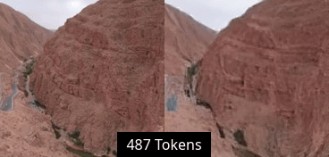
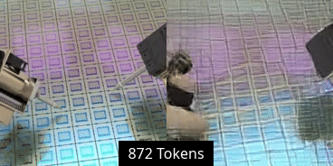
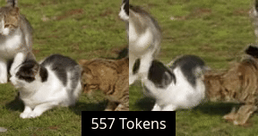

# TiTok for Video Tokenization
### Overview:
This repo contains the code, datasets and checkpoints for an experimental 1D video tokenizer. Research is ongoing, so expect improvements over time!

The tokenizer uses [M-RoPE](https://arxiv.org/abs/2409.12191) and multi-resolution training to allow for flexible input resolutions and compression ratios.

### Reconstructions:
<div>
    
    
    
    
</div>

### Models:
#### V1:
- Resolutions: 144-192p, different aspect ratios.
- Frame counts: 8-20
- Token counts: 128-1024
- Codebook size: 8575
- Parameters: ~350m?

https://huggingface.co/NilanE/TiTok-Video-VariableComp-V1


### Model eval:
TODO

### Setup:
Install dependencies with:
```
python3 -m pip install -r requirements.txt
```
  
### Inference (instructions outdated):
Run [the eval notebook](inference.ipynb) in jupyter-lab.
For a more detailed guide, see [INFERENCE.md](INFERENCE.md)

The resolution, frame count and token count can be set arbitrarily during inference, but the farther they are outside of those seen during training, the more artifacts appear.


### Training:
#### Launch:
```
PYTHONPATH=./ python3 titok_pl.py config=configs/tiny.yaml
```
---

### Other:
#### Dataset links:
```
https://huggingface.co/datasets/NilanE/Vchitect_T2V_DataVerse_256p_8fps_wds (lighter version of Vchitect_T2V_DataVerse)
https://huggingface.co/datasets/Vchitect/Vchitect_T2V_DataVerse
https://huggingface.co/datasets/sailvideo/MiraData-v1
https://huggingface.co/datasets/sailvideo/webvid10m
https://huggingface.co/datasets/WenhaoWang/VideoUFO
https://huggingface.co/datasets/TIGER-Lab/VISTA-400K
https://huggingface.co/datasets/LanguageBind/Open-Sora-Plan-v1.1.0
```

#### Uses code/ideas from:
```
https://github.com/bytedance/1d-tokenizer
https://github.com/ShivamDuggal4/adaptive-length-tokenizer
https://github.com/lucidrains/vector-quantize-pytorch
https://github.com/microsoft/VidTok
https://github.com/hywang66/LARP
...and more, cited within the codebase.
```
